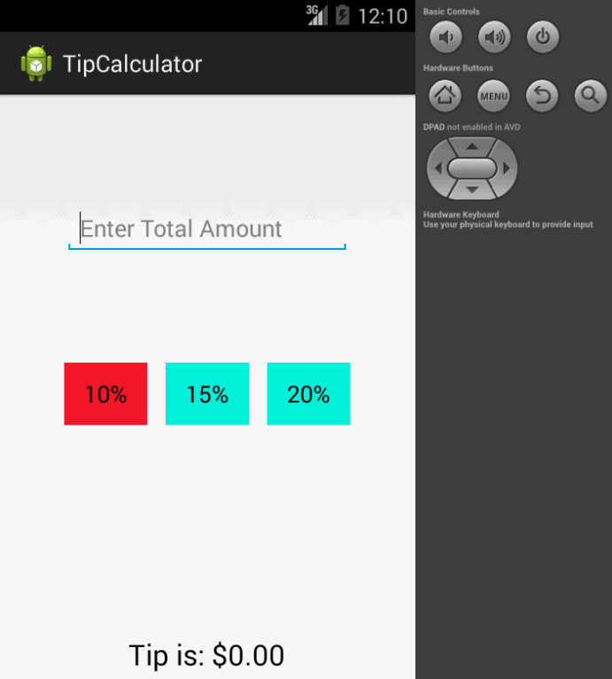

TipCalculator
=============

Project 1 - Tip Calculator

This project implements the basic objectives:

User is displayed the tip of specified percentage for specified entered amount
User enters the total amount of the transaction
User can select between tip amounts (i.e 10%, 15%, 20%)
Upon selecting tip amount, formatted tip value is displayed

As well as optional objective:
User changes the total amount and updated tip is reflected automatically
Improved UI by adding colors for buttons and using nested relative views

Here is .gif of the project in action:

